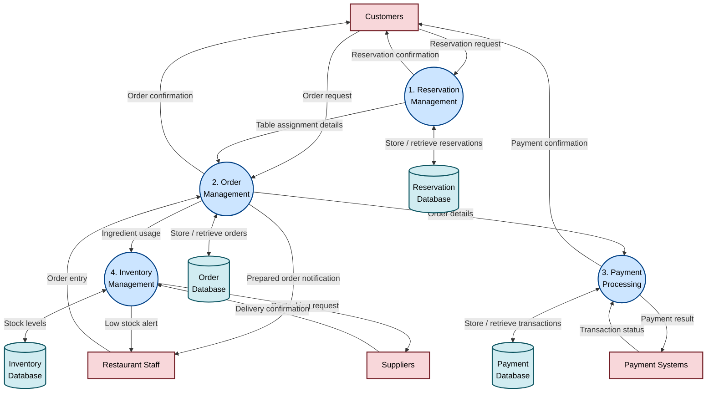

# Data Flow Diagram – Level 1
# Benvenuto Restaurant Management System

```mermaid
flowchart TD
    %% External Entities
    Customers[Customers]:::entity
    Suppliers[Suppliers]:::entity
    Staff[Restaurant Staff]:::entity
    PaymentSystems[Payment Systems]:::entity

    %% Processes
    P1((1. Reservation\nManagement)):::process
    P2((2. Order\nManagement)):::process
    P3((3. Payment\nProcessing)):::process
    P4((4. Inventory\nManagement)):::process

    %% Data Stores
    DB1[(Reservation\nDatabase)]:::datastore
    DB2[(Order\nDatabase)]:::datastore
    DB3[(Payment\nDatabase)]:::datastore
    DB4[(Inventory\nDatabase)]:::datastore

    %% Customer flows
    Customers -->|Reservation request| P1
    P1 -->|Reservation confirmation| Customers
    Customers -->|Order request| P2
    P2 -->|Order confirmation| Customers

    %% Reservation Management
    P1 <-->|Store / retrieve reservations| DB1
    P1 -->|Table assignment details| P2

    %% Order Management
    Staff -->|Order entry| P2
    P2 -->|Prepared order notification| Staff
    P2 <-->|Store / retrieve orders| DB2
    P2 -->|Order details| P3
    P2 -->|Ingredient usage| P4

    %% Payment Processing
    P3 <-->|Store / retrieve transactions| DB3
    P3 -->|Payment confirmation| Customers
    P3 -->|Payment result| PaymentSystems
    PaymentSystems -->|Transaction status| P3

    %% Inventory Management
    P4 <-->|Stock levels| DB4
    P4 -->|Low stock alert| Staff
    P4 -->|Restocking request| Suppliers
    Suppliers -->|Delivery confirmation| P4

    classDef entity fill:#f8d7da,stroke:#721c24,stroke-width:2px,color:#000;
    classDef process fill:#cce5ff,stroke:#004085,stroke-width:2px,color:#000;
    classDef datastore fill:#d1ecf1,stroke:#0c5460,stroke-width:2px,color:#000;
```
