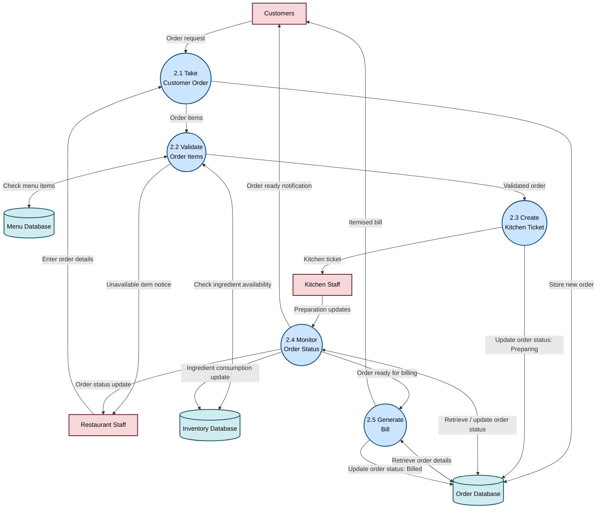

# Data Flow Diagram – Level 2
# Benvenuto Restaurant Management System
# Decomposition of Process 2: Order Management

```mermaid
flowchart TD
    %% External Entities
    Customers[Customers]:::entity
    Staff[Restaurant Staff]:::entity
    Kitchen[Kitchen Staff]:::entity

    %% Data Stores
    DB1[(Order Database)]:::datastore
    DB2[(Menu Database)]:::datastore
    DB3[(Inventory Database)]:::datastore

    %% Level 2 Processes
    P2_1((2.1 Take\nCustomer Order)):::process
    P2_2((2.2 Validate\nOrder Items)):::process
    P2_3((2.3 Create\nKitchen Ticket)):::process
    P2_4((2.4 Monitor\nOrder Status)):::process
    P2_5((2.5 Generate\nBill)):::process

    %% Customer Order Entry
    Customers -->|Order request| P2_1
    Staff -->|Enter order details| P2_1
    P2_1 -->|Order items| P2_2
    P2_1 -->|Store new order| DB1

    %% Validation
    P2_2 <-->|Check menu items| DB2
    P2_2 <-->|Check ingredient availability| DB3
    P2_2 -->|Validated order| P2_3
    P2_2 -->|Unavailable item notice| Staff

    %% Kitchen Operations
    P2_3 -->|Kitchen ticket| Kitchen
    P2_3 -->|Update order status: Preparing| DB1

    %% Order Status Monitoring
    Kitchen -->|Preparation updates| P2_4
    P2_4 <-->|Retrieve / update order status| DB1
    P2_4 -->|Order status update| Staff
    P2_4 -->|Order ready notification| Customers
    P2_4 -->|Ingredient consumption update| DB3
    P2_4 -->|Order ready for billing| P2_5

    %% Billing
    P2_5 <-->|Retrieve order details| DB1
    P2_5 -->|Itemised bill| Customers
    P2_5 -->|Update order status: Billed| DB1

    classDef entity fill:#f8d7da,stroke:#721c24,stroke-width:2px,color:#000;
    classDef process fill:#cce5ff,stroke:#004085,stroke-width:2px,color:#000;
    classDef datastore fill:#d1ecf1,stroke:#0c5460,stroke-width:2px,color:#000;
```
