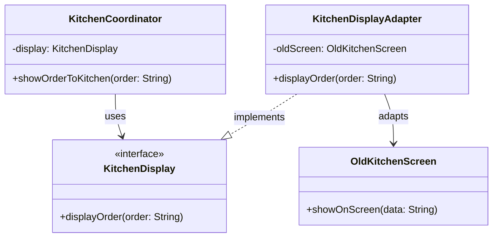

# Adapter – Benvenuto RMS
This diagram illustrates how a legacy kitchen screen interface is bridged to work with the current kitchen display interface.

```mermaid
classDiagram
    class KitchenCoordinator {
        +showOrderToKitchen(order: String)
        -display: KitchenDisplay
    }

    class KitchenDisplay {
        <<interface>>
        +displayOrder(order: String)
    }

    class OldKitchenScreen {
        +showOnScreen(data: String)
    }

    class KitchenDisplayAdapter {
        -oldScreen: OldKitchenScreen
        +displayOrder(order: String)
    }

    KitchenCoordinator --> KitchenDisplay : uses
    KitchenDisplayAdapter ..|> KitchenDisplay : implements
    KitchenDisplayAdapter --> OldKitchenScreen : adapts
```
