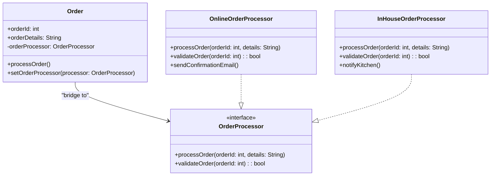

# Bridge - Benvenuto RMS

```mermaid
classDiagram
    class Order {
        +orderId: int
        +orderDetails: String
        +processOrder()
        -orderProcessor: OrderProcessor
        +setOrderProcessor(processor: OrderProcessor)
    }

    class OrderProcessor {
        <<interface>>
        +processOrder(orderId: int, details: String)
        +validateOrder(orderId: int): bool
    }

    class OnlineOrderProcessor {
        +processOrder(orderId: int, details: String)
        +validateOrder(orderId: int): bool
        +sendConfirmationEmail()
    }

    class InHouseOrderProcessor {
        +processOrder(orderId: int, details: String)
        +validateOrder(orderId: int): bool
        +notifyKitchen()
    }

    Order --> OrderProcessor : "bridge to"
    OnlineOrderProcessor ..|> OrderProcessor
    InHouseOrderProcessor ..|> OrderProcessor
```
