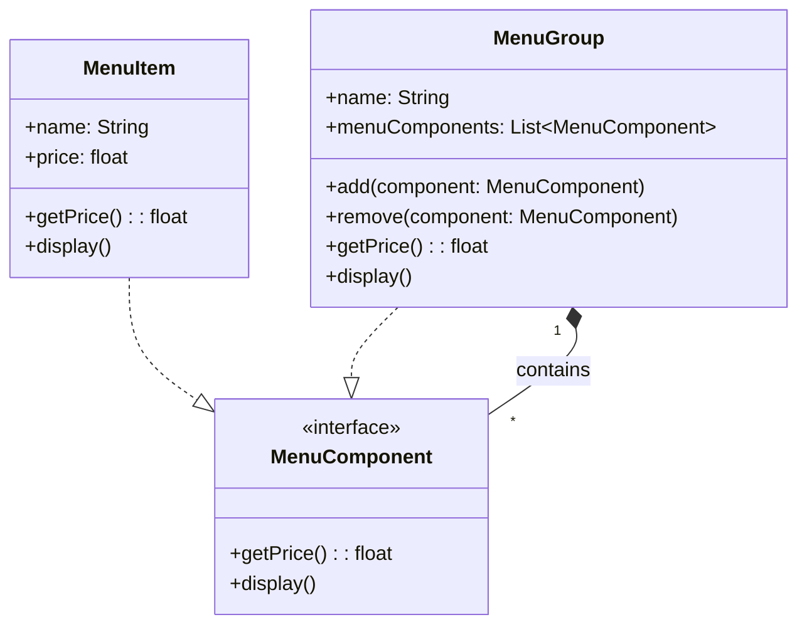

# Composite - Benvenuto RMS

```mermaid
classDiagram
    class MenuComponent {
        <<interface>>
        +getPrice(): float
        +display()
    }

    class MenuItem {
        +name: String
        +price: float
        +getPrice(): float
        +display()
    }

    class MenuGroup {
        +name: String
        +menuComponents: List~MenuComponent~
        +add(component: MenuComponent)
        +remove(component: MenuComponent)
        +getPrice(): float
        +display()
    }

    MenuItem ..|> MenuComponent
    MenuGroup ..|> MenuComponent

    MenuGroup "1" *-- "*" MenuComponent : contains
```
