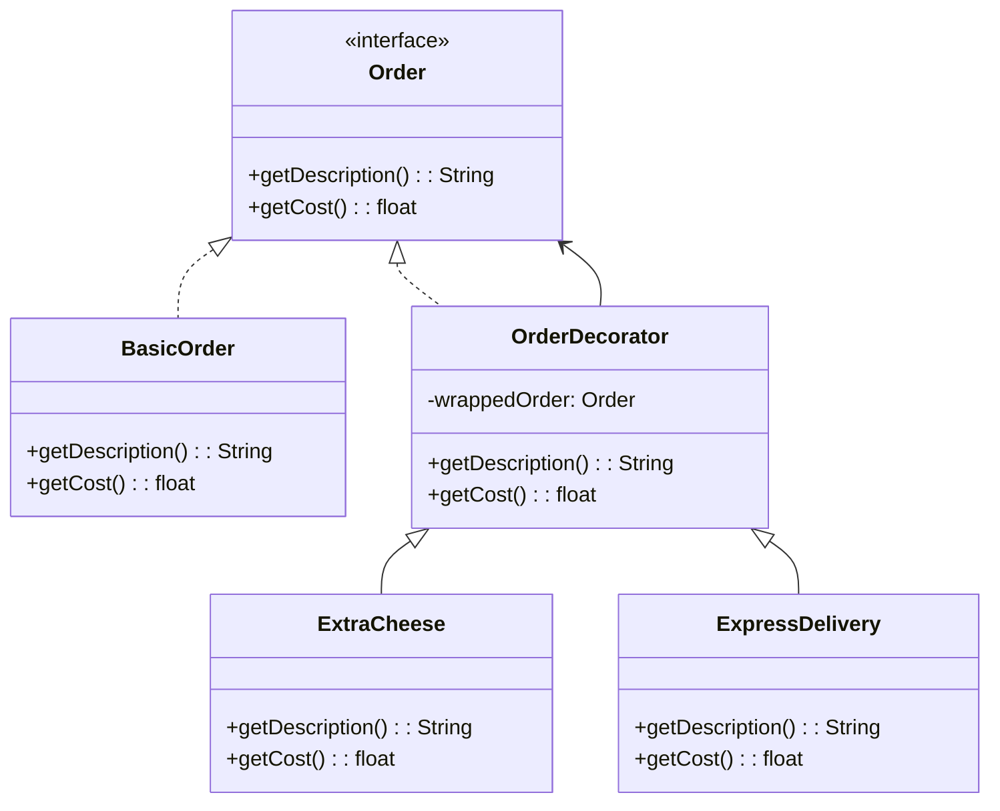

# Decorator - Benvenuto RMS

```mermaid
classDiagram
    class Order {
        <<interface>>
        +getDescription(): String
        +getCost(): float
    }

    class BasicOrder {
        +getDescription(): String
        +getCost(): float
    }

    class OrderDecorator {
        -wrappedOrder: Order
        +getDescription(): String
        +getCost(): float
    }

    class ExtraCheese {
        +getDescription(): String
        +getCost(): float
    }

    class ExpressDelivery {
        +getDescription(): String
        +getCost(): float
    }

    Order <|.. BasicOrder
    Order <|.. OrderDecorator
    OrderDecorator <|-- ExtraCheese
    OrderDecorator <|-- ExpressDelivery
    OrderDecorator --> Order
```
