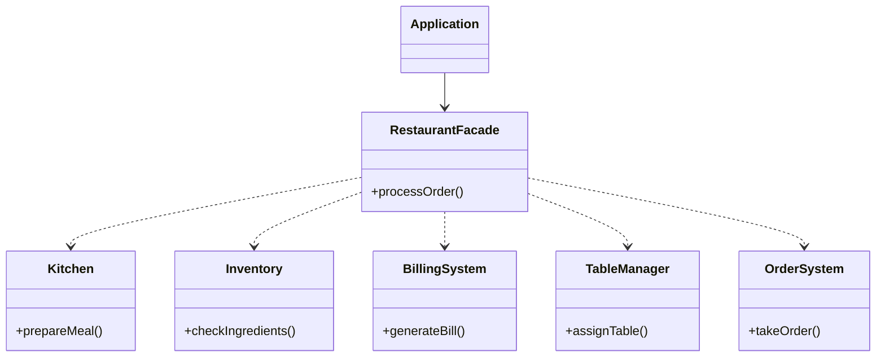

# Facade - Benvenuto RMS

```mermaid
classDiagram
    class Application {
    }

    class RestaurantFacade {
        +processOrder()
    }

    class Kitchen {
        +prepareMeal()
    }

    class Inventory {
        +checkIngredients()
    }

    class BillingSystem {
        +generateBill()
    }

    class TableManager {
        +assignTable()
    }

    class OrderSystem {
        +takeOrder()
    }

    Application --> RestaurantFacade
    RestaurantFacade ..> Kitchen
    RestaurantFacade ..> Inventory
    RestaurantFacade ..> BillingSystem
    RestaurantFacade ..> TableManager
    RestaurantFacade ..> OrderSystem
```
