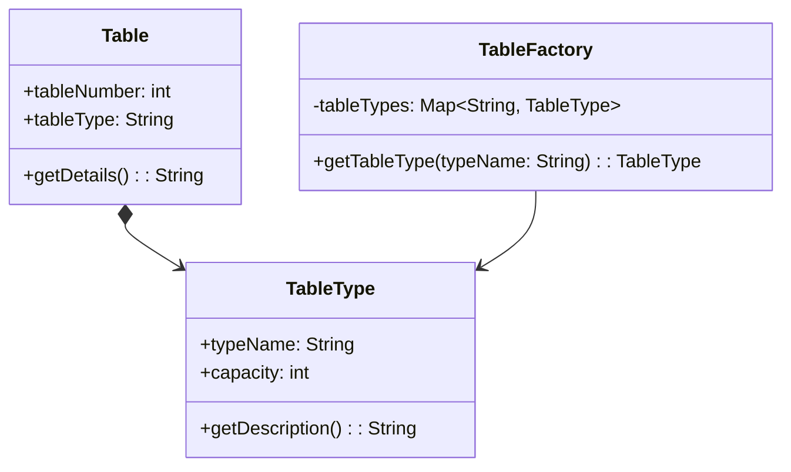

# Flyweight - Benvenuto RMS

```mermaid
classDiagram
    class Table {
        +tableNumber: int
        +tableType: String
        +getDetails(): String
    }

    class TableType {
        +typeName: String
        +capacity: int
        +getDescription(): String
    }

    class TableFactory {
        -tableTypes: Map~String, TableType~
        +getTableType(typeName: String): TableType
    }

    Table "" *--> "" TableType : 
     TableFactory --> TableType 
```
