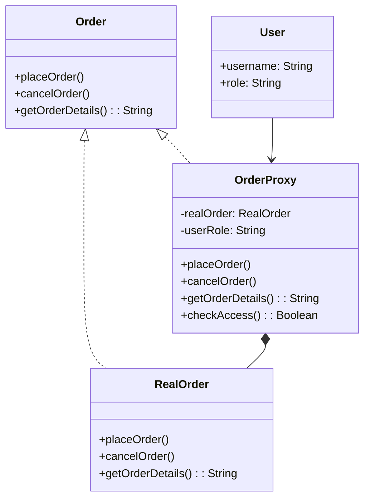

# Proxy - Benvenuto RMS

```mermaid
classDiagram
    class Order {
        +placeOrder()
        +cancelOrder()
        +getOrderDetails(): String
    }

    class RealOrder {
        +placeOrder()
        +cancelOrder()
        +getOrderDetails(): String
    }

    class OrderProxy {
        -realOrder: RealOrder
        -userRole: String
        +placeOrder()
        +cancelOrder()
        +getOrderDetails(): String
        +checkAccess(): Boolean
    }

    class User {
        +username: String
        +role: String
    }

    Order <|.. RealOrder
    Order <|.. OrderProxy
    OrderProxy *-- RealOrder
    User --> OrderProxy
```
