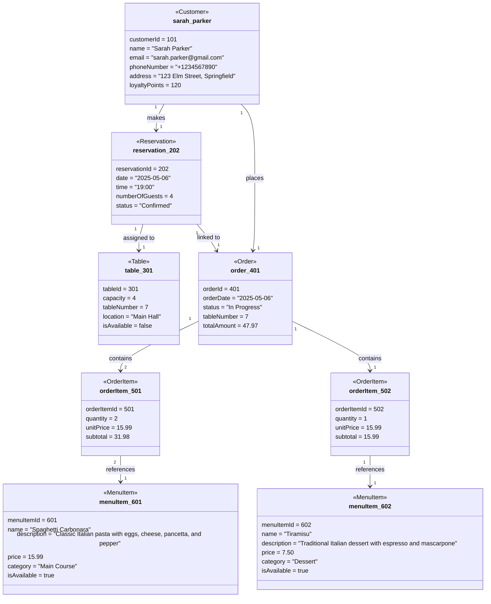

# Object Diagram – Benvenuto Restaurant Management System

```mermaid
classDiagram
    class sarah_parker {
        <<Customer>>
        customerId = 101
        name = "Sarah Parker"
        email = "sarah.parker@gmail.com"
        phoneNumber = "+1234567890"
        address = "123 Elm Street, Springfield"
        loyaltyPoints = 120
    }

    class reservation_202 {
        <<Reservation>>
        reservationId = 202
        date = "2025-05-06"
        time = "19:00"
        numberOfGuests = 4
        status = "Confirmed"
    }

    class table_301 {
        <<Table>>
        tableId = 301
        capacity = 4
        tableNumber = 7
        location = "Main Hall"
        isAvailable = false
    }

    class order_401 {
        <<Order>>
        orderId = 401
        orderDate = "2025-05-06"
        status = "In Progress"
        tableNumber = 7
        totalAmount = 47.97
    }

    class orderItem_501 {
        <<OrderItem>>
        orderItemId = 501
        quantity = 2
        unitPrice = 15.99
        subtotal = 31.98
    }

    class orderItem_502 {
        <<OrderItem>>
        orderItemId = 502
        quantity = 1
        unitPrice = 15.99
        subtotal = 15.99
    }

    class menuItem_601 {
        <<MenuItem>>
        menuItemId = 601
        name = "Spaghetti Carbonara"
        description = "Classic Italian pasta with eggs, cheese, pancetta, and pepper"
        price = 15.99
        category = "Main Course"
        isAvailable = true
    }

    class menuItem_602 {
        <<MenuItem>>
        menuItemId = 602
        name = "Tiramisu"
        description = "Traditional Italian dessert with espresso and mascarpone"
        price = 7.50
        category = "Dessert"
        isAvailable = true
    }

    sarah_parker "1" --> "1" reservation_202 : makes
    reservation_202 "1" --> "1" table_301 : assigned to
    sarah_parker "1" --> "1" order_401 : places
    reservation_202 "1" --> "1" order_401 : linked to
    order_401 "1" --> "2" orderItem_501 : contains
    order_401 "1" --> "1" orderItem_502 : contains
    orderItem_501 "2" --> "1" menuItem_601 : references
    orderItem_502 "1" --> "1" menuItem_602 : references
```
